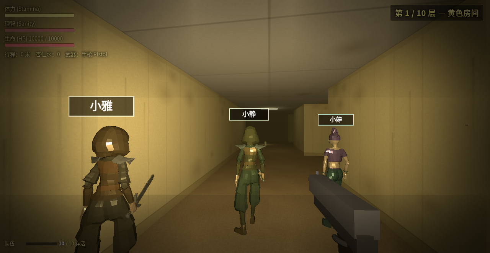
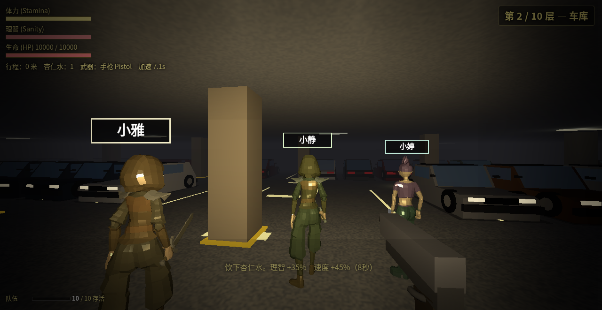
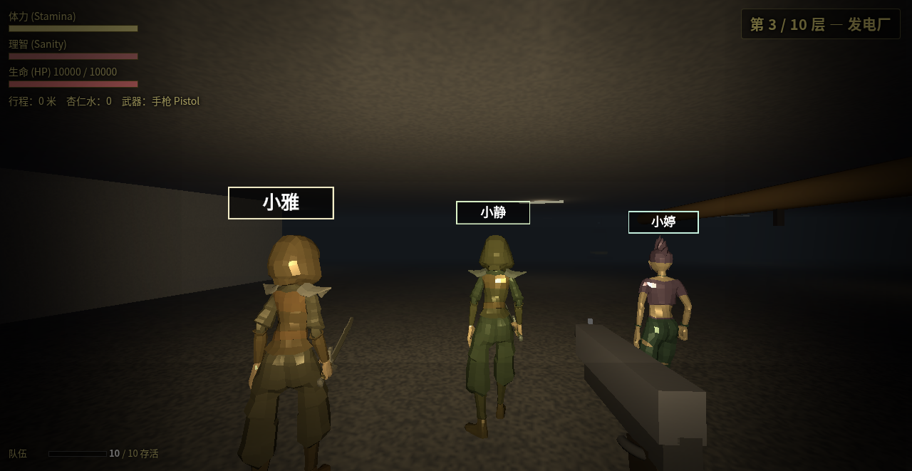
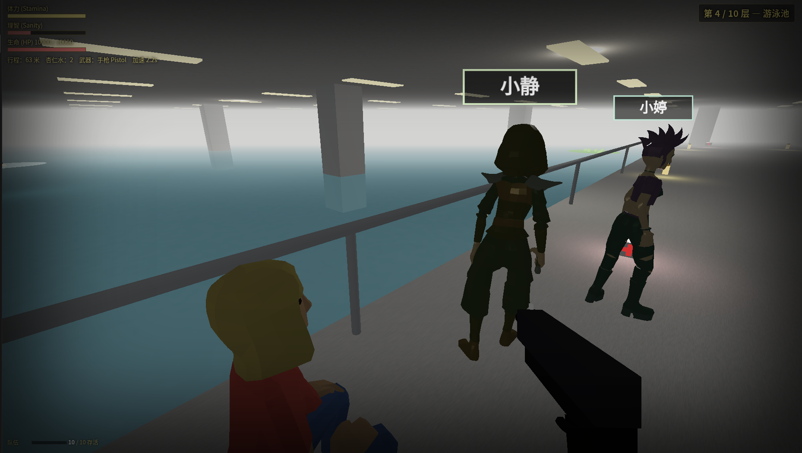
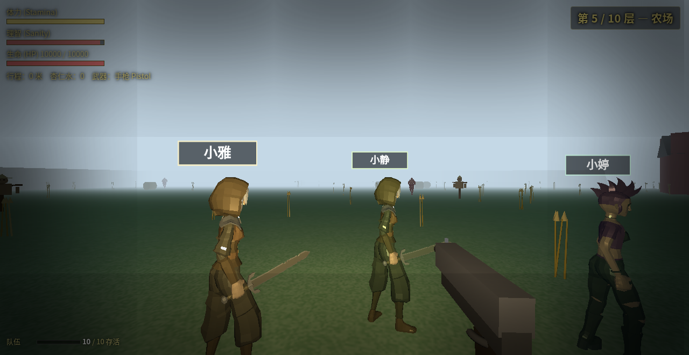
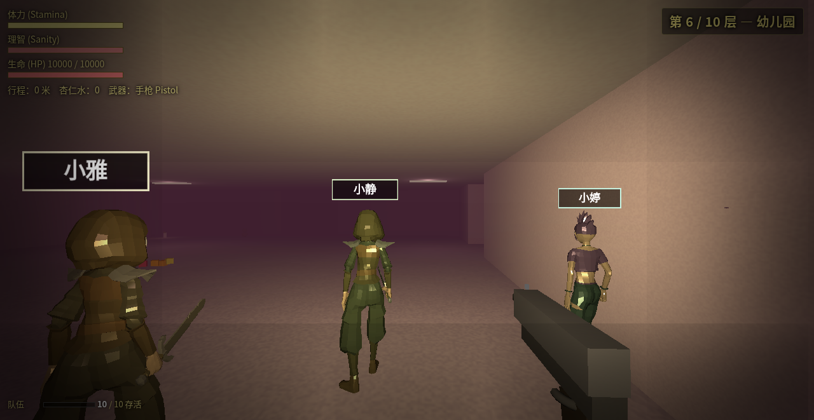
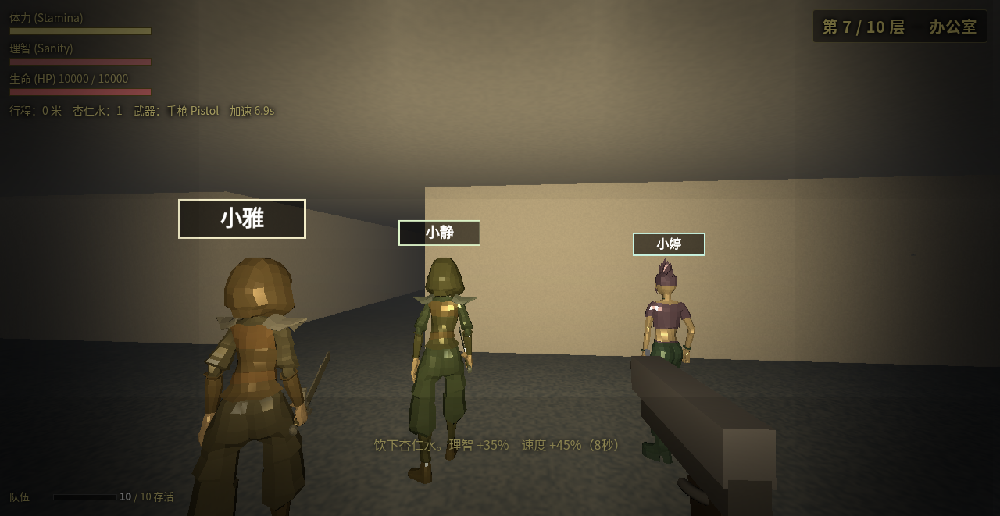
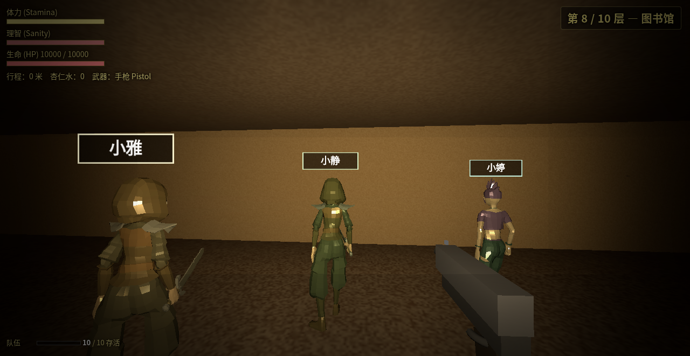
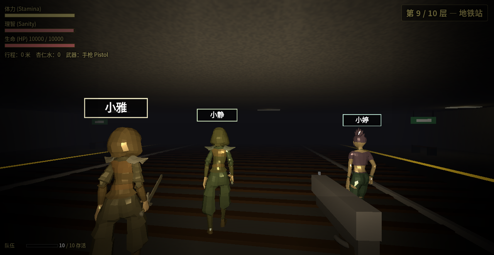
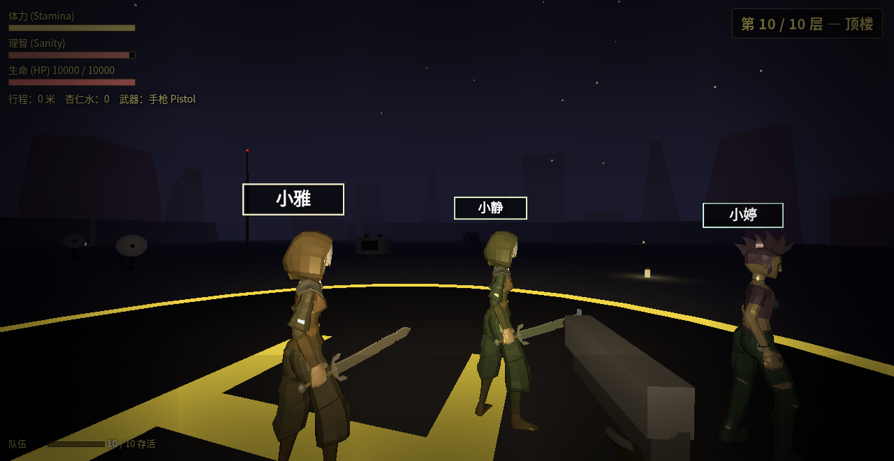

# 十层视觉一览

每层一张截图，由 `script/screenshot.sh` 在 headless Chrome 中拍摄：
传送到该层 → 等 GLTF 模型完成升级 → 镜头水平扫一圈把队伍带进画面 →
最后一帧落盘。

下面这一批来自仓库 HEAD `f141799`，存放在
[`screenshots/20260504-151943Z-f141799-dirty/`](screenshots/20260504-151943Z-f141799-dirty/)。
旧批次（`2358814` 那一轮）保留在
[`screenshots/old-2358814-batch/`](screenshots/old-2358814-batch/) 做对照。

想刷新视觉日志：

```bash
bash script/screenshot.sh           # 拍 10 层；目录命名 时间戳-shortsha
bash script/screenshot.sh --floor 5 # 只重拍单层
```

---

## 1. 黄色房间 (yellow rooms)

经典的霉黄壁纸 + 潮湿地毯 + 嗡嗡日光灯。出生层，10 个同伴在你身边围成一圈。



## 2. 车库 (garage)

整片开放车库：水泥柱列、停满的轿车 / 掀背车、地面停车格涂线。



## 3. 发电厂 (powerplant)

暗色机房、蓝色电火花。



## 4. 游泳池 (pool) ⚠️

整层一个巨型下沉式泳池，只留 2m 外圈通道。池中潜伏：火花电缆 (`1000/s`)、
冒泡毒水 (`800/s`)、扑咬飞蛾（80 HP/口，杀虫剂一击）。
按 `E` 上小船可无视所有水中危险。



## 5. 农场 (farm)

露天蓝天、麦田、栅栏。视野最开阔的一层 —— 同伴站位最容易看清。



## 6. 幼儿园 (kindergarten)

粉色墙 + 散落玩具。



## 7. 办公室 (office)

米色隔间 + 显示器。



## 8. 图书馆 (library)

高大橡木书架（4 层分隔板 + 随机厚度多色书脊）+ 绿铜读书台灯 + 卡片柜 + 倒地书堆。



## 9. 地铁站 (subway)

石碴道床 + 木枕 + 双钢轨 + 黄色站台警示线 + 长椅 + 绿底 EXIT 灯牌。



## 10. 顶楼 (rooftop) — 终点

黎明前的开放屋顶：H 直升机停机坪、HVAC 机箱、卫星天线、水塔、天线杆 + 红色航空
警示灯、白色护栏，远景城市天际线 silhouette + 真实月面贴图（Wikimedia Commons,
Gregory H. Revera, CC BY-SA 3.0）+ 星点。打通九层之后从这里升上来。


